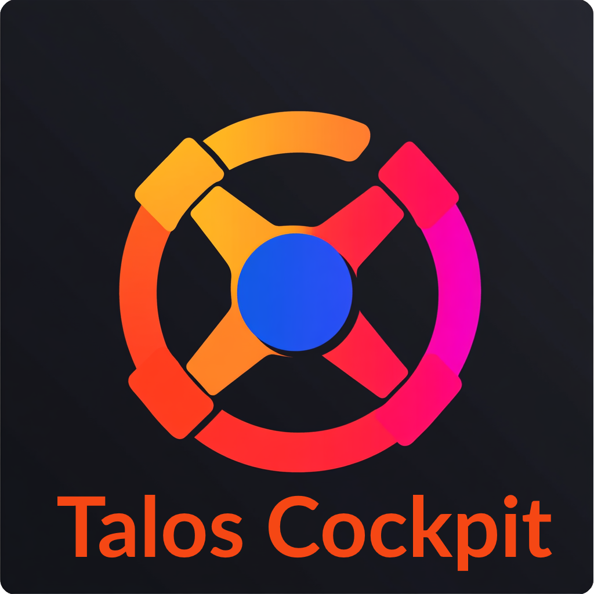

# Talos Cockpit





# Prerequisites

## Talos Cluster
Follow those [steps](https://www.talos.dev/v1.8/advanced/talos-api-access-from-k8s/) to enable Talos API Access From Kubernetes

At least:
* [Enable the feature](https://www.talos.dev/v1.8/advanced/talos-api-access-from-k8s/#enabling-the-feature)

> [!WARNING]  
    Talos cockpit needs ```os:admin``` to be allowed in the feature to manage Operating System and K8S Updates 

## Cockpit Config

There are 2 ways for you to configure talos-cockpit file or Env

### Using **config.yml** 

You'll have to mount the file into /app/

> [!NOTE] config.yml
> ```yaml
># Global configurations
>global:
>  debug: false
>
>images:
>#  custom_registry: registry.example.com/SubPath
>  installer: "ghcr.io/siderolabs/installer"
>  
># schedule configurations
>schedule:
>  sync_members: 1 # in Minutes
>  sys_upgrade: 15
>
># Talosctl configurations
>talosctl:
>  endpoint: "localhost" 
>
># Database credentials (unused/not implemented)
>#database:
>#  user: "admin"
>#  pass: "super-pedro-1982"
>
># Notifications
>notifications:
>  mail:
>    recipient: "mail@example.com"
>    host: smtp.example.com
>    username: username
>    password: password
>
>templates:
>  layout_path: "../templates/layouts/"
>  include_path: "../templates/"
>
>static:
>  path: "../static"
> ```

### Env vars

Define Env vas in you talos-cockpit pod

| Variable Name | Type | Description | Default value |
| ------------------ | ---- | ----------- | ------------- |
| COCKPIT_DEBUG | Boolean | Enable log/runtime debug | False |
| COCKPIT_SCHED_SYNC | Int | Sync and updates each X Minutes | 5 |
| COCKPIT_SCHED_SYS_UPGRADE | Int | Sync and updates each X Minutes | 10 |
| **TALOS_API_ENDPOINT** | String | Endpoint API used by talos-cockpit | |
| COCKPIT_CUSTOM_REGISTRY | String | Custom registry path (Ex: registry.example.com/SubPath) | |
| TALOS_IMAGE_INSTALLER | String | Custom Installer image | "ghcr.io/siderolabs/installer" |
| K8S_PROXY_ENABLED | Boolean | Is kube-proxy used in your cluster? | False |
| K8S_IMAGE_PREPULL | Boolean | Would you pre pull tolas needed image before update ? | False |
| KUBECONFIG | String | Kubeconfig PATH | os.ENV("KUBECONFIG") |
| MAIL_RECIPIENT | String | Mail recipient ||
| MAIL_CC | String | Mail Copy ||
| MAIL_HOST | String | SMTP Host ||
| MAIL_USERNAME | String | SMTP Username ||
| MAIL_PASSWORD | String | SMTP password ||
| TMPL_LAYOUT_PATH | String | Templates layout path | /app/templates/layouts |
| TMPL_INCLUDE_PATH | String | Templates path | /app/templates |
| STATIC_PATH | String | Static path | /app/static |
| DB_USERNAME | String | NOT USED | |
| DB_PASSWORD | String | NOT USED | |

	} `yaml:"schedule"`
	Talosctl struct {
		Endpoint string `yaml:"endpoint" envconfig:"TALOS_API_ENDPOINT"`
	} `yaml:"talosctl"`
	Kubernetes struct {
		ConfigPath string `yaml:"config" envconfig:"KUBECONFIG"`
	} `yaml:"kubernetes"`
	//Database struct {
	//	Username string `yaml:"user" envconfig:"DB_USERNAME"`
	//	Password string `yaml:"pass" envconfig:"DB_PASSWORD"`
	//} `yaml:"database"`
	Notifications struct {
		Mail struct {
			Recipient string `yaml:"recipient" envconfig:"MAIL_RECIPIENT"`
			Cc        string `yaml:"cc" envconfig:"MAIL_CC"`
			Host      string `yaml:"host" envconfig:"MAIL_HOST"`
			User      string `yaml:"username" envconfig:"MAIL_USERNAME"`
			Password  string `yaml:"password" envconfig:"MAIL_PASSWORD"`
		} `yaml:"mail"`
	} `yaml:"notifications"`
	Templates struct {
		LayoutPath  string `yaml:"layout_path" envconfig:"TMPL_LAYOUT_PATH"`
		IncludePath string `yaml:"include_path" envconfig:"TMPL_INCLUDE_PATH"`
	} `yaml:"templates"`
	Static struct {
		Path string `yaml:"path" envconfig:"STATIC_PATH"`
	} `yaml:"static"`

***Vars Required***

# Deploy and enjoy

Use the example above to deploy a pod in the ````namespace allowed```` to use Talos API.

Replace the **TALOS_API_ENDPOINT** env var by **your controllers vIP** or the IP/Name of one of your controllers.


> [!WARNING]  
    TALOS_API_ENDPOINT value should have been declared in Talos SANs

> [!NOTE] 
  To avoid env vars declaration in your deployment you'll better create a secret and mount it with ```mountPath: "/app/config.yml" ``` & ```subPath: "config.yml"```

> [!NOTE] cockpit-deployment.yaml
> ```yaml
>apiVersion: apps/v1
>kind: Deployment
>metadata:
>  creationTimestamp: null
>  name: talos-cockpit
>spec:
>  selector:
>    matchLabels:
>      app: talos-cockpit
>  strategy: {}
>  template:
>    metadata:
>      creationTimestamp: null
>      labels:
>        app: talos-cockpit
>    spec:
>      containers:
>      - image: mstrohl/talos-cockpit:v0.0.3
>        imagePullPolicy: Always
>        name: talos-cockpit
>        resources: {}
>        volumeMounts:
>        - mountPath: /var/run/secrets/talos.dev
>          name: talos-secrets
>        - mountPath: "/app/config.yml"
>          subPath: "config.yml"
>          name: cockpit-config
>          readOnly: true
>        #env:
>        #  - name: TALOS_API_ENDPOINT
>        #    value: "10.0.0.15"
>        #  - name: COCKPIT_SCHED_SYNC
>        #    value: "1"
>        #  - name: COCKPIT_SCHED_SYS_UPGRADE
>        #    value: "720"
>      volumes:
>      - name: talos-secrets
>        secret:
>          secretName: talos-cockpit-talos-secrets
>      - name: cockpit-config
>        secret:
>          secretName: cockpit-config
>status: {}
>---
>apiVersion: talos.dev/v1alpha1
>kind: ServiceAccount
>metadata:
>    name: talos-cockpit-talos-secrets
>spec:
>    roles:
>        - os:admin
>---
>apiVersion: rbac.authorization.k8s.io/v1
>kind: ClusterRole
>metadata:
>  name: talos-cockpit
>rules:
>- apiGroups:
>  - ""
>  resources:
>  - pods
>  - nodes
>  verbs:
>  - get
>  - list
>  - watch
>---
>apiVersion: rbac.authorization.k8s.io/v1
>kind: ClusterRoleBinding
>metadata:
>  name: talos-cockpit
>subjects:
>  - kind: ServiceAccount
>    # Reference to upper's `metadata.name`
>    name: default
>    # Reference to upper's `metadata.namespace`
>    namespace: kube-system
>roleRef:
>  kind: ClusterRole
>  name: talos-cockpit
>  apiGroup: rbac.authorization.k8s.io
>---
>apiVersion: v1
>kind: Service
>metadata:
>  name: talos-cockpit
>  labels:
>    app: talos-cockpit
>spec:
>  ports:
>  - port: 8080
>    targetPort: 8080
>  selector:
>    app: talos-cockpit


## Api usage

curl -X POST "http://localhost:8080/api/sysupdate?member_id=talos-xxx-yyy&enable=true"
curl -X POST "http://localhost:8080/api/sysupdate?cluster_id=xxxxxxxxxxxxx&enable=false"
